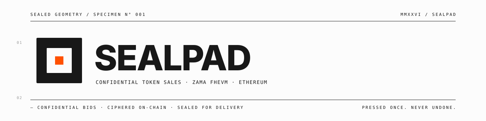

<p align="center">
  <picture>
    <source media="(prefers-color-scheme: dark)" srcset=".github/banner-dark.svg">
    
  </picture>
</p>

<p align="center">
  <a href="https://github.com/YanYuanFE/sealpad/actions/workflows/ci.yml"></a>
</p>

**Confidential token-sale platform on the Zama FHEVM.** Bid amounts and
contributions stay encrypted on-chain throughout the sale; only the final
clearing price and your own allocation become public after settlement.

---

## What it does

- **Fixed-Price sales** — creator sets one price; participants submit
  FHE-encrypted contribution amounts; oversubscribed sales scale every
  participant down pro-rata.
- **Sealed-bid Dutch Auctions** — each bidder picks a public bid price plus
  an FHE-encrypted investment amount; the contract walks bid-price levels
  from highest to lowest and produces a uniform clearing price. Bidders at
  the clearing price share leftover tokens pro-rata.
- **Independent deposit pool** — users `addDeposit` first (public),
  then submit encrypted contributions/bids. Updating a contribution moves
  _only the ciphertext_ — no funds change hands, leaving no on-chain trace
  of bid revisions.
- **Linear vesting (optional)** — cliff + linear release after settlement,
  configured per sale.
- **Whitelists (optional)** — Merkle-tree gated access.
- **Any sale-token decimals** — the per-sale `saleTokenScale` is read from
  the saleToken's own `decimals()` at create time; cost math stays accurate
  for 6-, 8-, 18-decimal tokens alike.

## Live deployment

Sepolia testnet (chainId `11155111`):

| Contract           | Address                                                                                                                          |
| ------------------ | -------------------------------------------------------------------------------------------------------------------------------- |
| `SealPadFactory`   | [`0x7a65faf7A25443aB70DCcc069a6b42BF208f15e0`](https://sepolia.etherscan.io/address/0x7a65faf7A25443aB70DCcc069a6b42BF208f15e0) |
| `SaleVault` (impl) | [`0x723B4Df76567f2445A870E71e717B0D9694dB56a`](https://sepolia.etherscan.io/address/0x723B4Df76567f2445A870E71e717B0D9694dB56a) |

The factory deploys EIP-1167 clones of `SaleVault` per sale. Per-sale
addresses are discoverable via `factory.getAllSales()`,
`factory.salesByCreator(addr)`, or `factory.salesByParticipant(addr)`.

## Architecture

```
┌─────────────────────────────────────────────────────────────┐
│                   SealPadFactory                            │
│  • createSale(params) → deploys clone, pulls sale tokens    │
│  • allSales[], salesByCreator, salesByParticipant indexes   │
│  • registerParticipant callback (called by vault on first   │
│    contribute/bid to keep the global index in sync)         │
└──────────────────────┬──────────────────────────────────────┘
                       │ Clones.clone()
                       ▼
┌─────────────────────────────────────────────────────────────┐
│   SaleVault (per-sale clone)                                │
│  • holds creator, saleToken, payToken, caps, vesting, FHE   │
│  • addDeposit / withdrawDeposit / contribute / bid          │
│  • finalize → makePubliclyDecryptable                       │
│  • settleFixed / settleDutch (verifies KMS proof)           │
│  • claim (linear vesting)                                   │
└─────────────────────────────────────────────────────────────┘
```

The state machine inside each vault:

```
Active ──► Finalizing ──► Settled    (success)
                       └► Failed     (soft-cap missed / no participants)
Active ──► Cancelled                (creator cancels, no participants yet)
```

`finalize()` publishes the FHE handles for KMS public decryption;
`settleFixed/Dutch(values, proof)` runs `FHE.checkSignatures` on-chain to
verify the KMS proof before computing allocations.

## Quick start

Prerequisites: Node 20+, npm, and a Sepolia wallet with some test ETH.

```bash
git clone https://github.com/YanYuanFE/sealpad.git
cd sealpad

# 1) Run contract tests (FHEVM mock harness — no Sepolia needed)
cd contracts
npm install
npm run compile
npm test

# 2) Start the frontend (talks to the live Sepolia factory by default)
cd ../frontend
npm install
npm run dev
# → http://localhost:5173
```

## Project layout

```
.
├── contracts/                   FHEVM Hardhat project (Solidity 0.8.27)
│   ├── contracts/
│   │   ├── SealPadFactory.sol   Factory + clone deployment + indexes
│   │   ├── SaleVault.sol        Per-sale clone (initialize, settle, claim)
│   │   └── mocks/MockERC20.sol  Test token with custom decimals
│   ├── test/SealPadFactory.ts   43 cases covering both sale types
│   ├── deploy/deploy.ts         hardhat-deploy script
│   └── hardhat.config.ts
└── frontend/                    Vite + React + wagmi + viem
    ├── src/
    │   ├── pages/               Landing, Home, CreateSale, SaleDetail, MyActivity, Docs
    │   ├── components/sale/     DepositPanel, ContributePanel, SettleBanner, ClaimPanel, …
    │   ├── lib/
    │   │   ├── fhevm.ts         Singleton wrapper around @zama-fhe/relayer-sdk
    │   │   ├── sale-formatters.ts  per-sale decimals + fmtPay/fmtSale helpers
    │   │   └── …
    │   └── config/
    │       ├── contracts.ts     Hand-curated factory + vault ABIs + factory address
    │       └── wagmi.ts         RainbowKit / wagmi config
    └── .prettierrc.yml
```

## Common commands

### `contracts/`

```bash
npm run compile              # hardhat compile + typechain
npm run test                 # full test suite (FHE mock)
npm run lint                 # solhint + eslint + prettier
npm run deploy:sepolia       # deploy SealPadFactory (auto-deploys impl)
npm run verify:sepolia       # Etherscan source verification
npm run chain                # local hardhat node
```

Hardhat vars (`npx hardhat vars set <NAME>`):

| Var                    | Purpose                                                |
| ---------------------- | ------------------------------------------------------ |
| `MNEMONIC`             | Defaults to the standard "test test ... junk" if unset |
| `INFURA_API_KEY`       | RPC for non-public-node fallback (optional)            |
| `ETHERSCAN_API_KEY`    | Source verification                                    |
| `DEPLOYER_PRIVATE_KEY` | Takes precedence over `MNEMONIC` for `deploy:sepolia`  |

### `frontend/`

```bash
npm run dev          # vite dev server on :5173
npm run build        # tsc -b && vite build
npm run lint         # eslint
npm run format       # prettier --write src/
npm run format:check # prettier --check src/ (used by CI)
```

Frontend env (optional):

| Var                            | Purpose                                |
| ------------------------------ | -------------------------------------- |
| `VITE_SEALPAD_FACTORY_ADDRESS` | Override the hardcoded factory address |

The Sepolia RPC URL is hardcoded to `ethereum-sepolia-rpc.publicnode.com`
in `frontend/src/config/wagmi.ts`. WalletConnect projectId is currently a
placeholder and must be replaced before any production deploy.

## Testing

```bash
cd contracts
npm test
```

The suite runs entirely under FHEVM's mock harness (`@fhevm/hardhat-plugin`).
43 cases cover:

- Factory: indexing by creator, `registerParticipant` access control,
  `getAllSales` ordering, double-init rejection on a clone.
- createSale: parameter validation, hard-cap-vs-capacity check, arbitrary
  `saleToken` decimals.
- contribute/bid: encrypted-update flow without funds movement, max
  participant cap, deposit-required guard.
- finalize: empty-sale failure, both sale types entering Finalizing.
- settle: 6-decimal end-to-end, uint64-wrap-safe summation, Dutch
  per-price-level pro-rata, hard-cap clipping, soft-cap miss recovery.
- claim/withdraw: vesting (cliff + linear), participant vs deposit-only
  withdraw paths.

## Tech stack

- **Smart contracts**: Solidity 0.8.27 · FHEVM (`@fhevm/solidity`,
  `@zama-fhe/relayer-sdk`) · OpenZeppelin Contracts (Clones, ERC-20, MerkleProof, Math)
- **Toolchain**: Hardhat · hardhat-deploy · TypeChain · solidity-coverage · solhint · gas-reporter
- **Frontend**: React 19 · Vite · TypeScript · TailwindCSS v4 · shadcn/ui ·
  wagmi v2 · viem · RainbowKit · `@zama-fhe/relayer-sdk/web`
- **Privacy**: FHE-encrypted contribution amounts (`euint64`) +
  KMS-attested public decryption at settlement time

## Documentation

- **In-app docs** — visit `/app/docs` once the dev server is running, or the
  deployed app, for an end-user-facing walkthrough of the lifecycle, sale
  types, and integration notes.
- [`TECHNICAL_DESIGN.md`](./TECHNICAL_DESIGN.md) — original design doc (Chinese).
  Some details (e.g. the Dutch tier-bid model) diverge from the implementation;
  see `CLAUDE.md` for the current source of truth.
- [`CLAUDE.md`](./CLAUDE.md) — concise architectural notes used by AI agents
  working on the codebase; useful as a fast-orient reference for humans too.

## License

MIT. See contract source headers for SPDX identifiers.
